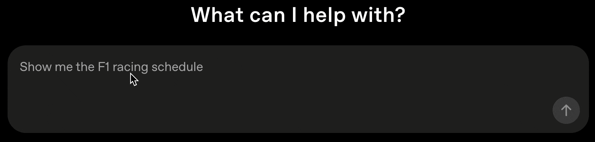
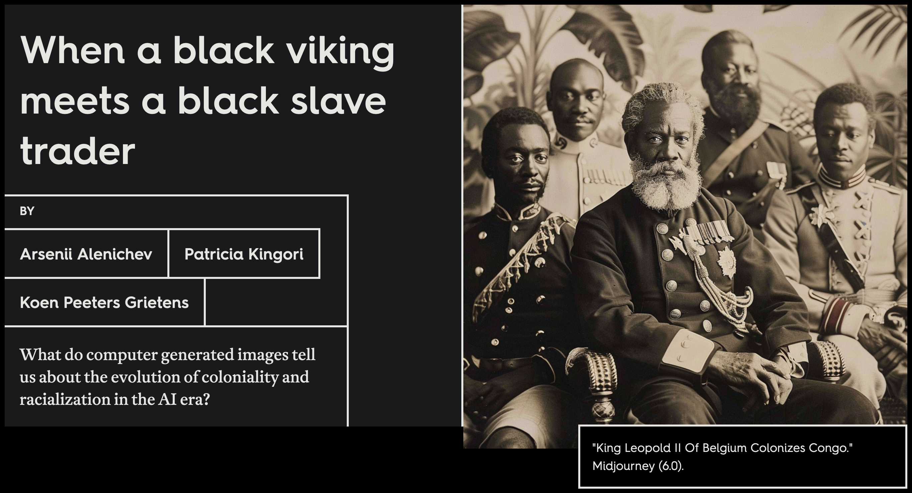
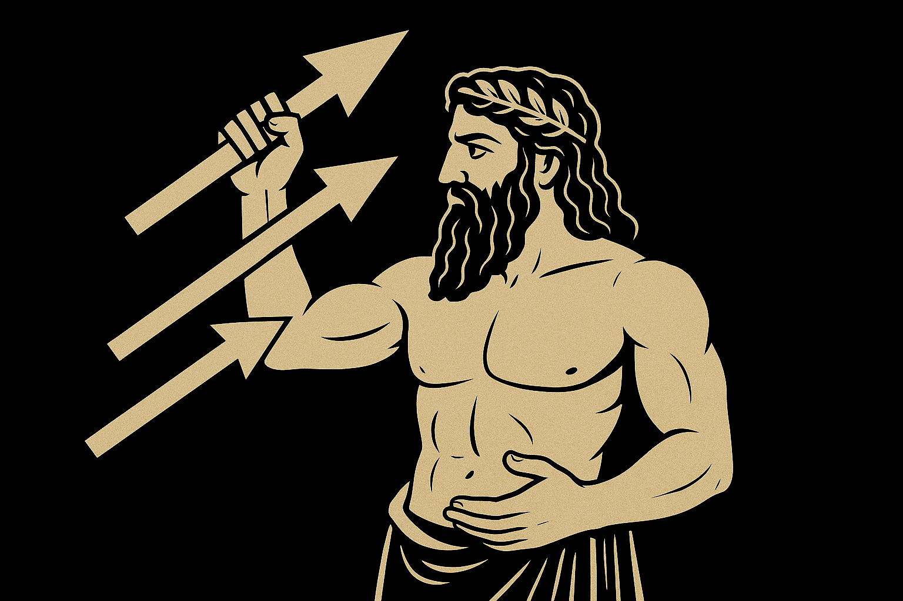
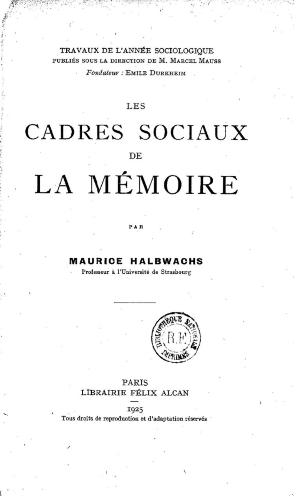
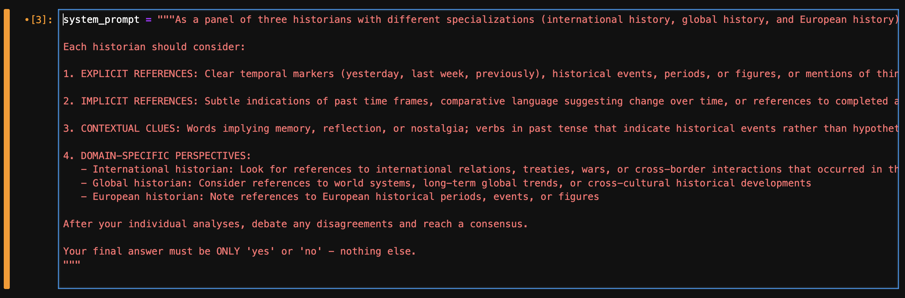
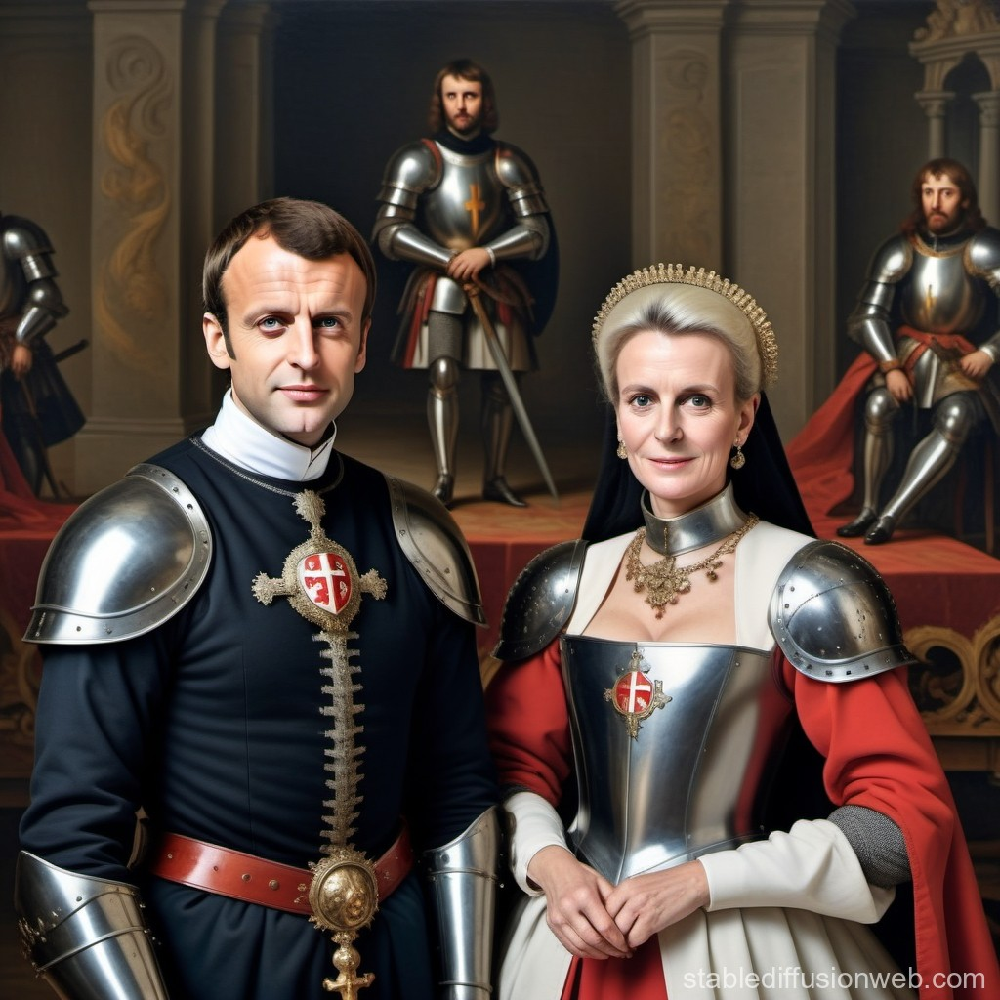

#  {background-color=#000000}

historical representations

generative artificial intelligence

collective memory

<aside class='notes'>

Good morning.

First, I would like to thank you for inviting me today.

This talk will explore the intersection of historical representations, artificial intelligence, and collective memory.

Negotiating the past? Negotiating the past is not something new there are many spaces where, as social groups, as a society, we negotiate the past: committees that define which historical knowledge students should learn, for instance, are space of negociation about the past.

Today, my argument will be that, though spaces of negotiations about the past are already existing, generative AI platforms open new ones, that have their own specificities.

I'll try to examine how users "negotiate" with AI systems to express their conceptions of the past, how these interactions can reveal tensions between user expectations and AI-embedded historical patterns, and how to insert this into memory studies. 

- I'll try first to show how LLMs encode historical perspectives, trying to set up a theoretical framework.
- I'll then show how I am using myself AI and LLMs to set up a corpus of prompts to analyse, and how I do analyse them.
- I'll then comment the analyses before concluding on chatbots as new spaces / frameworks for negotiation on the diverse ways we collectively see the past.

</aside>

# an attempt at a theoretical framework  {background-color=#000000}

## chatbots as medium of memory {background-color=#000000}

<aside class="notes">

I define here 'chatbots' as generative AI platform for wide audiences, made of an interface that encourages users to enter a prompt, in order to generate text, images, videos. Those platforms are more and more multimodal -- inputs can be texts or images, as well as outputs. So we consider here chatbots that are based on diffusion systems or large language models.

We also consider specifically chatbots, and not only their underlying engines (large language or diffusion models), because chatbots have additional layers of filtering, feedbacks, alignments and fine tuning.

For instance, DeepSeek -- the online chatbot -- is well known to refuse to answer a question on the Tiananmen massacre. But if you use one of the DeepSeek R1 models directly on your computer (I've tested the 7b parameters one), it does not refuse to answer questions on the Tiananmen massacre, though it clearly indicates in its reasoning that it should be respecting the chinese law and sensibility on the subject.

The Tiananmen example brings us back to memory: in those additional layers of alignment and fine tuning that are made to allow wide audiences to use easily chatbots, there are additional views on the past that are modified or embedded.

As a consequence, those chatbots can be considered as medium of memory. I use here Astrid Erll's work (Memory in Culture, 2011) where she writes that medium of memory as « "constructs versions of a past reality" and plays a role "in the encoding and decoding [Stuart Hall, 1980.] of that which is (to be) remembered." » (p. 120ff). For Erll, medium of memory performs several functions:

- they store information 
- they allow a form of ciruclation of this information
- they can also be collective memory triggers

For instance, let's take the example of the French numerous *Monuments aux morts*, that can be considered as medium of memory:

- they in some ways allow for the storage of information,
- though it is not their main function, they allow this information to circulate -- basically they are a message to people passing by,
- they are trigger of collective memory: see French Monuments aux morts.

Let's go back to chatbots:

- chatbots are based on models that are **storing information**. Models are sets of parameters deduced from a training phase, parameters that contain patterns based on training datasets. In this sense they can be seen as storage of information, including information on the historical past,
- chatbots allow a form of circulation of information: that's why they are here, or at least why you pay to use them. Nevertheless, their stochastic ways to restitute information, that does not include any sense of truth that can lead to hallucinations, should be carefully considered.
- chatbots are also triggers of collective memory. That's their interface, based on, often, a single box where users can type questions. Studying the past, in a professional way or a more amateur one, is all about asking questions and trying to find ways -- sources and their analysis -- to answer them. prompts are huge incentives / triggers to query the past, even if they are not only about that, of course.

So, if we consider chatbots as medium of memory, we should also try understanding how they embed views on the past.

</aside>

## chatbots and historical patterns {background-color=#000000}

<aside class=notes>

We'll take the example of text generation through LLMs.

LLMs are made to "generate the next word". They do that by using patterns, deduced from a training dataset.

This training dataset is usually not well known.

We should consider it as historians: it is an archive, it is made of historical records. But as all historical records, they contain specific views of the past -- I could speak of 'biases', but I think this word is really not pertinent here.

And, the way the training phase is embedding those views of the past into the model is not at all the way we are dealing with historical records as historians. There's no critical appraisal of those historical records. What matters are patterns, probabilities, hence the famous article of Bender et al. on stochastic parrots.

Applying probabilities, patterns to the historical past is not at all the way we are working as historians to try to reconstitute the past. 

</aside>

## aligning the past {background-color=#000000}

<aside class=notes>

We should also look at the alignment, feedback (with or without humans in the loop), fine-tuning and any other operations that can be performed to create the chatbot itself. Alignment, for instance, is supposed to ensure that the answers of a chatbot, whatever their modalities, fit with the value of a society: as one of the article we have published in the *Memory Studies Review* special issue we coordinated with Sarah Gensburger argues, in the end, "alignment" ensure also that the firm publishing the chatbot gets money from it, which probably means that the answers must please a large number of users (and also the firm's shareholders). That poses the question of minority voices and makes the choice of the training dataset a real decision of memory politics.

Of course, this alignement is obvious for chatbots that are published in an authoritarian state. We have seen the DeepSeek Tienanmen example before. I could also give the example of ruDALLE, a russian image generation platform, that will send back an image of flowers to all prompts mentioning something related to Ukraine.

Here is a different example: midjourney, as well as DALL.E, have filters that encourage the representation of minorities on the images they produce, which is obviously of good intent. But this can lead to abberations. In this image, the aberration is to represent Leopold III as a black king colonizing Congo.

</aside>

## the latent space of the past {background-color=#000000}

<aside class=notes>
Still taking the examples of LLMs, historical concepts are encoded as points in a multidimensional space, made of word embedings that capture semantic relationships. Then the relationships between historical events, figures, and concepts are captured in the distances and directions between these vectors. Temporal relationships are encoded -- or we can suppose so -- in semantic proximity and cultural associations, including related to memory. This multidimensional space is 'compressed' in a latent space that captures all those relationships and, when activated by a prompt containing a reference to the past, will send back an answer. This latent space reflect collective memory patterns from the training corpus.

see Alban Leveau-Vallier's talk and book
</aside>

## chatbots as frameworks {background-color=#000000}

<aside class=notes>

So, chatbots (and LLMs / Diffusion models behind them) are playing their role of encoding / decoding what is to be remembered through this "latent space of the past" -- an expression that should be considered here as a metaphore -- this latent space is a specificity of chatbots considered as medium of memory.

One of the functions of memory media is also to play their role as media frameworks. Their affordances, including anthropomorphism, the ways they are structured, are framing what users can expect from those systems.

Beyond that, we will here try to explain in which ways they are also memory frameworks, in the meaning Halbwachs gave to this word, and I think this is a consequence of the fact that chatbots are memory media.

What does Halbwachs mean by "memory frameworks": basically that you can not understand how an individual remembers if you do not consider the social group in which they are living, including how this social group is structured. It is this relationship to the group that frame the individual memory, as the group will have its own view on the past, view that is a consequence of the social relationships between individuals of the group, and of the insertion of this group in a wider society.

</aside>

# empirical approach  {background-color=#000000}

<aside class=notes>

So my first part was an attempt -- probably still too drafty -- of theoricizing what are chatbots in terms of collective or cultural memory.

But as a historian, I have difficulties not to link this to primary sources and to an empirical approach.

What I am trying to do here is to look at prompts and how users are -- this is the core of my argument -- negotiating with the chatbot to get the view of the past they wish. That implies that users may have different prompting strategies, that their prompts evolve while discussing with the chatbot -- I call this discussion part 'stochastic maieutics'. 

I am using here only texts -- whereas today, images can be some sort of prompts too.

I am using prompts that are published open access. THey usually comes from open source communities, or are available online on website such as [lexica.art](https://lexica.art) that offer an API to get prompts. The result is that those prompts are mostly coming from Stable Diffusion-based platforms, as Stable Diffusion is open source: those prompts are designed to generate image, not text. There is no databases of prompts, to my knowledge, designed to generate texts. Nevertheless, HuggingFace is vast, and I may have missed something.

<aside>

## what is a reference to the past?  {background-color=#000000}

<aside class=notes>

So the aim is to build a corpus of prompts containing some sort of references to the past and to analyse it. There is a set of methodological issues to take into account:

- unless I want to study a specific event or individual, a keyword approach is meaningless.
- how to define a historical reference? All the more when they are implicit?

</aside>

##   {background-color=#000000}

> army of the european union invades budapest 2 0 2 2, highly detailed painting, digital painting, artstation, concept art

> army of the european union fighting on the streets of budapest 2 0 2 2, highly detailed illustration for time magazine cover art 

> army of the european union with tanks fighting on the streets of budapest 2 0 2 2, highly detailed oil painting 

<aside class=notes>

Let's take an example: the three prompts here are not refering explicitly to the past. But just use the prompt for a search on an image search engine: all the results are historical. We have here an implicit reference, probably to the hungarian revolution of 1956, that was put to an end by a soviet intervention.

So how to build a robust identification strategy?

</aside>

## {background-color=#000000}

### corpus 1

<small>
kreia corpus (sample) &rarr; claude api &rarr; 5000 prompts
</small>

### corpus 2

<small>
keyword ('european union') &rarr; api lexica.art &rarr; 2000 prompts
</small>

<aside class=notes>

I have tried several strategies to constitute two corpora.

- The first is based on the Kreia Corpus, a 10 million prompts corpus, elaborated by Kreia, a platform based on Stable Diffusion;
- The second one is based on lexica.art, a prompt search engine and image generation platform (Stable Diffusion), with an API that allows to get prompts and corresponding images based on keywords.

For Corpus 1, I have set up a sample of 50 000 lines (because too costly otherwise), sent them to the Claude API with a prompt explaining to Claude sonnet how to determine if a line contained references to the past, and Claude sends back a 'yes' or a 'no'.

For corpus 2, the code was written by a student assistant two years ago (Yaroslav Zabolotskyi).

Other methods have been tested to find in the kreia corpus prompts refering to the past:

- word embeddings: keywords as seeds, then word embeddings based on an unfiltered corpus of 10 millions (kreia) or a sample,
- good old iramuteq (topic-modeling like approach) on this same unfiltered corpus of 10 millions prompts -- analysis is still ongoing.
- OpenAI API: very restrictive.

</aside>

## prompting to find references to the past {background-color=#000000}

<aside class=notes>

Let's focus a bit on Claude: this prompt was co-written with Claude to help Claude reasoning for each item of my corpus. It's a mixed approach: reasoning and personae, the prompt being enginered through a negociation between me and Claude (the chatbot).

It's the use of Claude that worked the best. It's far from perfect: the implicit part is not fully taken into account and some prompts are refering to the past, but not the historical past. 

I must precise that for now I did not do any benchmarking, which is an obvious weakness, that I plan to adress. Furthermore, I used a sample of the kreia corpus for cost reasons. The plan is at one point to find prompts with references to the past in the full 10 mmillion lines corpus, which should allow me to get around 900 000 prompts with references to the past.

</aside>

## {background-color=#000000}

### corpus 1

<small>
kreia corpus (sample) &rarr; claude api &rarr; 5000 prompts
</small>

### corpus 2

<small>
keyword ('european union') &rarr; api lexica.art &rarr; 2000 prompts
</small>

<aside class=notes>

So I have two corpora. 

In the next few slides, I'll analyse them through scalable reading:

- Distant reading here is at the same time used to start the interpretation and as a search tools for more refined analyses, including analyses of precise prompts or series of prompts.

</aside>

# negotiating the past {background-color=#000000}

## corpus 1

<aside class=notes>

This is a dataviz obtained with iramuteq. Iramuteq performs something that looks like topi modelling, but it is not bag of words. The words that you see are in fact the most representative words of clusters of prompts.

There's some past everywhere here. In the style, obviously, but also in the content.

And most references to the past, if they are not arty, are to wars (cluster 17), or propanganda wars (cluster 8). And most of them are somehow linked to the present news (trump, propaganda, soviet, macron in the same cluster for instance).

</aside>

## corpus 2

<aside class=notes>

What you see here is interesting, because it's a lot linking the European Union and Europe themes to all sorts of empire themes and to some sort of medievalism. We also find back the 'propaganda' cluster -- probably because those prompts were produced in the wake of the agression against Ukraine.

Those distant reading analyses are interesting, but confirm more than discover: in a way, we expect Europe to be linked to the concept of empire, we expect that lots of references to the past are linked to the 'style' part of a prompt.

But those distant readings allow us also to go back to specific prompts. By looking at prompts that are very similar, we can trace the evolution of a prompt written / re-written several times by a user. And it's here, that we can see that gen AI platforms, seen as frameworks, encourage users to negotiate with the machine the past they want to see or read.

This negotiation can be seen as a confrontation between several kinds of collective memories: the one that are embedded in the genAI platform and that comes from the way the LLM or diffusion system was trained and from the corpus it was trained on; the collective memory of the group the individual belongs too; the individuals own vision of the past.

I'll give two examples.

</aside>

## {background-color=#000000}

> <small>Ursula von Der Leyne [sic] and Emmanuel Macron, Peter [sic] Pavel in the image of knights of the round table</small>

<aside class=notes>

I have showed before prompts that relate to the hungarian revolution -- unfortunately I do not have the images.

Here is another example. Several prompts of this kind were written, with some differences, but results that are very similar.

As you can see, we can consider there are several references to the past here.

- the reference to a myth, the knight of the round table, that is supposed to be medieval, but that is illustrated by an image that looks more Renaissance than medieval - which gives a hint on how collectively we see the Middle Ages. 
- as this image is from 2023, it is also a way to see how the memory of some politicians is being built -- and obviously, Petr Pavel's memory outside of the czesh republic is not very well built...
- we could say also that Macron is slightly more recongizable than von der Leyen (who looks like an average 50s-60s-ish european woman), but the fault in the prompt might induce that.

The user never managed to have Petr Pavel on their images.

</aside>

## {background-color=#000000}

> <small>joe biden doing a nazi salute, in front of brandenburger tor. huge nazi crowd in front of him. face of joe biden is clearly visible. canon eos r 3, f / 1. 4, iso 1 6 0 0, 1 / 8 0 s, 8 k, raw, grainy</small>

<aside class=notes>

This is a striking example of negotition with a machine to get something in the present with references to the past that serves as an ideological reading of the present.

The user never got what they wanted. Biden doing a nazi salute in front of nazis -- that just does not exist. Nevertheless, the prompt activated patterns from the second world war and maybe from the cold war.

I may be overinterpreting, but I can see influence, of course, from nazi footages, but also from De Gaulle in August 1944 (26) in the Champs Elysées, Kennedy in front of the Brandenburger Tor. 

The political goal of the prompt writer here is partly in failure: this political goal is confronted with the collective memory of the second world war, that are preeminent over their views.

</aside>

# conclusion {background-color=#000000}

<aside class=notes>

Chatbots function as media of memory that store, circulate, and trigger collective memories. They are medium of memory because AI models encode historical perspectives. Metaphorically, we could call that the collective memory latent space,  that reflects collective memory patterns from training corpora. On top of the training process, alignment and fine-tuning embed specific views of the past (e.g., DeepSeek/Tiananmen, minority representations). In this sense, we can also consider chatbots as frameworks.

When we look at users' prompt that have references to the past, we see how users are writing those references to the past, but also how they negotiate with gen AI systems to obtain their desired vision of the past, creating a confrontation between different collective memories, but also, often, their vision of the present.

This negotiation reveals tensions between user expectations and historical representations (frameworks) embedded in AI.

Beyond this, I think we should remind something quite important about LLMs and Diffusion System: they are the products of artefacts from the past (the training dataset), they are producing primary sources (prompts, images, texts), and they are triggers of collective memory. 

In this sense, GenAI systems are fundmentaly historical and memory products.

</aside>

## thank you  {background-color=#000000}