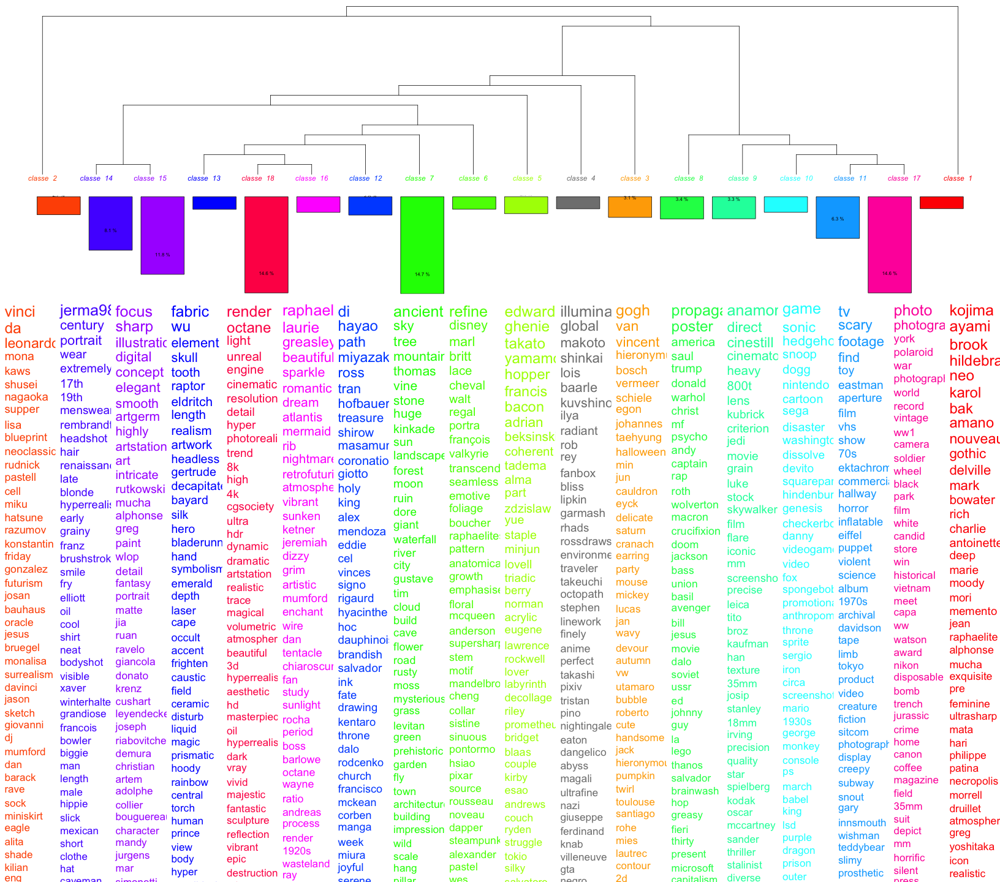

#  {background-color=#000000}

historical representations / artificial intelligence / collective memory

<!-- <small>prompt: Draw an image representing what is collective memory</small> -->

<aside class='notes'>

This talk will explore the intersection of historical representations, artificial intelligence, and collective memory.

Negotiating the past? In a way, we -- as a collective body, a society -- are "negotiating" the past in different spaces: committees that define which historical knowledge students should learn, for instance. In more dramatic circumstances, Truth and Reconciliation commissions, like in South Africa, are also some sort of spaces to negotiate the past, or, in this precise case, to negotiate which reparation should be defined from social groups that suffered from conflicting past. But to define those reparations, there should first be an agreement, or at least some sort of non opposition to the way the commission is seeing the past. Concerning an event that is more linked to my very old doctoral research, the international military trial in Nurenberg was a space of negotation of the past -- with the very caricatural position on the Katyn massacre for instance.

Let's go back to today's subject. I'll try to examine how users "negotiate" with AI systems to express their conceptions of the past, how these interactions can reveal tensions between user expectations and AI-embedded historical patterns, and how to instert this into memory studies.

Just one word on memory studies: historians are not that many to be active in the field of memory studies, though historians are a lot speaking about collective or cultural memory. To my opinion, it may have been useful -- because memory studies also fostered some sort of redefinition of what is memory -- but historians should be aware that today, they should also go into memory studies.

- I'll try first to show how LLMs encode historical perspectives, trying to set up a theoretical framework.
- I'll then show how I am using myself AI and LLMs to get prompts containing reference(s) to the past, to set up a corpus of prompts to analyse, and how I do analyse them.
- I'll then comment the analyses before concluding on chatbots / diffusion systems as new spaces for negotiation on the diverse ways we collectively see the past.  

1. **Theoretical Framework**: How LLMs encode historical perspectives
2. **Methodological Approach**: Analyzing historical references in prompts
3. **Results Analysis**: What prompt analysis reveals about historical imagination
4. **Conclusion**: New spaces for historical negotiation

</aside>

# an attempt at a theoretical framework  {background-color=#000000}

## medium of memory  {background-color=#000000}

> a medium of memory "constructs versions of a past reality" and plays a role "in the encoding and decoding of that which is (to be) remembered."

<small>see: Erll, A. Memory in Culture, p. 120ff.</small>

<aside class="notes">

- Material dimension (= memory potential)
  - Communication instruments: externalization, inter- and transmediality of memory. What makes possible the externalization from individual minds to media possible (speech, images, sounds, etc)
  - Media Technologies: storage (time) and dissemination (space) of memory: writing for instance, including in its current electronic form. Are not neutral containers: their "materiality, potentials and limits contribute to the character of the message" -- here, storage is the internet (the www morespecifically), but also their archive and the transformation of this archive into training dataset, the dissemination is assured through the exchange beteen a user (their prompt) and tthe interface to GenAI system (chatbots). 
  - Media offers: material objectivations and aesthetic forms of mediated memory -- prompt/answer

medium of memory can fulfill several memory functions:

- they store information 
- they allow a form of ciruclation of this information
- they can also be collective memory triggers

For instance: a monument or a statute can be a medium of memory:

- they in some ways allow for the storage of information
- they it is not their main function, they allow this information to circulate -- basically they are a message to people passing by
- they are trigger of collective memory: see French Monuments aux morts.

In another words, a medium of memory "constructs versions of a past reality" and plays a role "in the encoding and decoding of that which is (to be) remembered."

encoding/decoding = Stuart Hall, 1980.

</aside>

## chatbots as medium of memory {background-color=#000000}

<aside class="notes">

I define here 'chatbots' as generative AI platform for wide audiences, made of an interface that encourages users to enter a prompt, in ordre to generate text, images, videos, and are more and more multimodal -- inputs can be texts or images, as well as outputs. So we consider here chatbots that are based on diffusion systems or large language models.

We also consider chatbots, and not directly their underlying engines (large language models, or diffusion systems), because chatbots have additional layer of alignments and fine tuning.

For instance, DeepSeek -- the chatbot -- is well known to refuse to answer a question on the Tiananmen massacre. But if you use DeepSeek R1 (I've testes the 7b parameters one), it does not, though it clearly indicates in its reasoning that it should be respecting the chinese law and sensibility on the subject.

This Tienanmen example brings us back to memory: on those additional layers of allignment and fine tuning that are made to allow wide audiences to use easily chatbots, there are additional views on the past that are modified or embedded.

Let's go back to chatbots as medium of memory. 

- chatbots are based on models that are storing information. Models are sets of parameters deduced from a training phase, or patterns based on training datasets, that we don't always know precisely, but contain large expurged snapshots of the web, wikidpedia, probably books datasets, etc. In this sense they can be seen as storage of information, including information on the historical past,
- chatbots allow a form of circulation of information: that's why they are here, or at least why you pay to use them. Nevertheless, their stochastic ways to restitute information, that does not include any sense of truth, of facts, that can lead to hallucinations, should be carefully considered.
- chatbots are also triggers of collective memory. That's their interface, based on, often, a single box where users can type questions. Studying the past, in a professional way or a more amateur one, is all about asking questions and trying to find ways -- sources and their analysis -- to answer them. prompts are huge incentives / triggers to query the past, even if they are not only about that, of course.

So, if we consider chatbots as medium of memory, we should also try understanding how they embed views on the past.

</aside>

## chatbots and historical patterns {background-color=#000000}

<aside class=notes>

We'll take the example of text generation through LLMs. LLMs are statistical pattern recognizers. They can use patterns to "generate the next word" thanks to their training phase, based on trianing data. As I said earlier, this training data is not well known, but we should consider it as historians: it is an archive, it is made of historical records. But as all historical records, they contain specific views of the past -- I could speak of 'biases', but I think this word is really not pertinent. And, the way the training phase is embedding those views of the past into the model is not at all the way we are dealing with historical records as historians. There's no critical appraisal of those historical records. What matters are patterns, probabilities.

Hence the famouse article of Bender et al. on stochastic parrots. Applying probabilities, patterns to the historical past is not at all the way we are working to try to reconstitute the past. 

</aside>

## aligning the past {background-color=#000000}

<aside class=notes>

To this stochastic ways to generate texts / images about the past, we should also look at the alignment, feedback (with or without humans in the loop), fine-tuning and any other operations that can be performed to create the chatbot itself. Alignment, for instance, is supposed to ensure that the answers of a chatbot, whatever their modalities, fits with the value of a society: as one of the article we have published in the *Memory Studies Review* special issue we coordinated with Sarah Gensburger, in the end, "alignment" is all about pleasing the shareholders of the society that publishes the platform, which implies to get money from the chatbots, which probably means that the answers must please a large number of users.

Of course, this alignement is obvious for chatbots that are published in an authoritarian state. We have seen the DeepSeek Tienanmen example before. I could also give the example of ruDALLE, a russian image generation platform, that will send back an image of flowers to all prompts that are about Ukraine.

Here is a different example: midjourney, as well as DALL.E, have filters that allow the representation of minorities, which is obviously of good intent. But this can lead to abberations. In this image, the aberration is to represent Leopold III as a black king colonizing Congo.

</aside>

## the latent space of the past {background-color=#000000}

<aside class=notes>
Still taking the examples of LLMs, historical concepts are encoded as points in a multidimensional space, made of word embedings that capture semantic relationships. Then the relationships between historical events, figures, and concepts are captured in the distances and directions between these vectors. Temporal relationships are encoded -- or we can suppose so -- in semantic proximity and cultural associations, including related to memory, are embedded in language patterns. This multidimensional space is 'compressed' in a latent space that captures all those relationships and, when activated by a prompt containing a reference to the past, will send back an answer. This latent space reflect collective memory patterns from the training corpus.

see Alban Leveau-Vallier's talk and book
</aside>

<!-- À fusionner avec l'une des dias plus haut.

## collective memory and chatbots {background-color=#000000}

<aside class=notes>

Hence can we consider that: 

- LLMs or Diffusion models as 'repositories' of digitized collective memory
- Training data selection can be viewed as some sort of memory politics
- The "averaged" nature of AI-generated historical narratives
- Absence of contested memory in statistical consensus

From a memory studies perspective, LLMs function as repositories of digitized collective memory. The selection of training data constitutes a form of memory politics, determining which historical perspectives are included or excluded. The statistical nature of these models produces "averaged" historical narratives that often elide contestation and complexity.

See the special issue we co-edited with Sarah Gensburger, out last december. Several articles insist on the "average" nature of LLMs but also the capitalistic nature of chatbots and generative AI systems: they must give the most 'popular' or 'pleasant' version of an answer to a prompt, including the past. 

</aside>
-->

## chatbots as frameworks {background-color=#000000}

<aside class=notes>

So, chatbots (and LLMs / Diffusion models behind them) are palying their role of encoding / decoding what is to be remembered. I hope it is what I have just explained. One of the functions of memory media is also to play their role as media frameworks. Their affordances, including anthropomorphism , the ways they are structured are framing what users can expect from those systems.

Beyond that, we will here try to explain in which ways they are also memory frameworks, in the meaning Halbwachs gave to this word, and I think this is a consequence of the fact that chatbots are memory media.

What does Halbwachs mean by "memory frameworks": basically that you can not understand how an individual remembers if you do not consider the social group in which they are living. It is this relationship to the group that frame the individual memory, as the group will have its own view on the past, view that is a consequence of the social relationships between individuals of the group, and of the insertion of this group in a wider society.

</aside>

# empirical approach  {background-color=#000000}

<aside class=notes>

So my first part was an attempt -- probably still too drafty -- of theoricizing what are chatbots in terms of collective or cultural memory, what will be their effect.

But as a historian, I have difficulties not to link this to primary sources and to an empirical approach.

What I am trying to do here is to look at prompts and how users are -- this is the core of my argument -- negotiating with the chatbot to get the view of the past they wish. That implies that users may have different prompting strategies, that their prompts evolve while discussing -- I call this discussion part 'stochastic maieutics' -- with the chatbot. I will try to use at the same time close and distant reading of prompts. 

I am using here only texts -- whereas today, images can be some sort of prompts too.

I am using prompts that are published open access, usually comes from open source communities, or available online on website such as lexica.art that offer an API to get prompts. The result is that those prompts are mostly coming from Stable Diffusion-based platforms, as Stable Diffusion is open source: those prompts are designed to generate image, not text. There is no databases of prompts, to my knowledge, designed to generate texts. Nevertheless, HuggingFace is vast, and I may have missed something.

<aside>

## what is a reference to the past?  {background-color=#000000}

> army of the european union invades budapest 2 0 2 2, highly detailed painting, digital painting, artstation, concept art

> army of the european union fighting on the streets of budapest 2 0 2 2, highly detailed illustration for time magazine cover art 

> army of the european union with tanks fighting on the streets of budapest 2 0 2 2, highly detailed oil painting 

<aside class=notes>

So the aim is to build a corpus of prompts and to analyse it. There is a set of methodological issues to take into account:
- unless I want to study a specific event or individual, a keyword approach is meaningless.
- how to define a historical reference? All the more when they are implicit?
- how do I look for traces of temporalities in prompts, in language?

Let's take an example: the three prompts here are not refering explicitly to the past. But just use the prompt for a search on an image search engine: all the results are historical. We have here an implicit reference, probably to the hungarian revolution of 1956, that was put to an end by a soviet intervention.

So how to build a robust identification strategy?

I have tried several strategies:
- web scrapping on focused keywords (European union): limited corpus, humanly readable, some distant reading,
- word embeddings: keywords as seeds, then word embeddings based on the whole corpus of 10 millions or a sample,
- good old iramuteq (topic modeling like approach) on 10 millions prompts -- analysis still ongoing for 10 days,
- use of LLMs (best results if you do not want to start with keywords):
  - a local one (too ressource intensive for my computer),
  - APIs from Claude (9% of prompts) and OpenAI (3% of prompts).

Though not perfect -- the implicit part is not fully taken into account -- it's the use of Claude that worked the best, if you don't want to use keywords. I must precise that for now I did not do any benchmarking, which is an obvious weakness, that I plan to adress later.

In this prez, I'm using data from web scrapping and the use of LLMs part. Let's have a look on how I have used Claude.

</aside>

## prompting to find references to the past {background-color=#000000}

<aside class=notes>

In the end, most of the analysis here is based on a prompts corpus that was created using the Claude API on one side and web scrapping on the keyword 'european union' on the other side. Let's focus a bit on Claude: this prompt was co-written with Claude to help Claude reasoning for each item of my corpus. It's a mixed approach: reasoning and personae, the prompt being enginered through a negociation between me and Claude (the chatbot).

What is missing here is that I could add as an instruction to explain why it decided for a yes or for a no.

Once I have a corpus -- or, here, two corpora -- I can perform analyses. I will go from distant to close readings. Distant reading here is at the same time used to start the interpretation and as a search tools for more refined analyses, including analyses of precise prompts or series of prompts.

</aside>

## 

<aside class=notes>

This is a dataviz obtained with iramuteq. Iramuteq performs something that looks like topi modelling, but it is not bag of words. The words that you see are in fact the most representative words of clusters of prompts.

It is a dataviz that should still be reworked, in the sense that the settings used here should be refined to make the difference between two parts of the usual prompt: the part with content, the part with the style.

Nevertheless, there's some past everywhere here. In the style, obviously, but also in the content.

And most references to the past, if they are not arty, are to wars (cluster 17), or propanganda wars (cluster 8). And most of them are somehow linked to the present news (trump, propaganda, soviet, macron in the same cluster for instance).

</aside>

##

<aside class=notes>

Same dataviz, but with the webscrapped from lexica corpus, based on the 'european union' keyword. The lexica API has several sorts of keyword search and here is a keyword search that is based on word embeddings: it's not strictly a keyword search, more a 'thematic' search.

What you see here is interesting, because it's a lot linking the European Union and Europe themes to all sorts of empire themes and to some sort of medievalism. We also find back the 'propaganda' cluster -- probably because the Stable Diffusion 10 million prompts date back to 2022 and the web scrapping of lexica to 2023: it's hughly influenced by the agression against Ukraine.

</aside>

# negotiating the past {background-color=#000000}

<aside class=notes>

Those distant reading analyses are interesting, but confirm more than discover: in a way, we expect Europe to be linked to the concept of empire, we expect that lots of references to the past are linked to the 'style' part of a prompt.

But those distant readings allow us also to go back to specific prompts. By looking at prompts that are very similar, we can trace the evolution of a prompt written / re-written several times by a user. And it's here, that we can see that gen AI platforms, seen as frameworks, encourage users to negotiate with the machine the past they want to see or read.

This negotiation can be seen as a confrontation between several kinds of collective memories: the one that are embedded in the genAI platform and that comes from the way the LLM or diffusion system was trained and from the corpus it was trained on; the collective memory of the group the individual belongs too; the individuals own vision of the past.

I'll give two examples.

</aside>

## {background-color=#000000}

> <small>Ursula von Der Leyne [sic] and Emmanuel Macron, Peter Pavel in the image of knights of the round table</small>

<aside class=notes>

I have showed before prompts that relate to the hungarian revolution -- unfortunately I do not have the images.

Here is another example. Several prompts of this kind were written, with some differences, but results that are very similar.

As you can see, we can consider there are several references to the past here.

- the reference to a myth, the knight of the round table, that is supposed to be medieval, but that is in the end more Renaissance than medieval - which gives a hint on how collectively we see the Middle Age. 
- as this image is from 2023, it is also a way to see how the memory of some politicians is being built -- and obviously, Petr Pavel's memory outside of the czesh republic is not very well built...
- we could say also that Macron is slightly more recongizable than von der Leyen (who looks like an average 50s-60s-ish european woman), but the fault in the prompt might induce that.

The user never managed to have Petr Pavel on their images.

</aside>

## {background-color=#000000}

> <small>joe biden doing a nazi salute, in front of brandenburger tor. huge nazi crowd in front of him. face of joe biden is clearly visible. canon eos r 3, f / 1. 4, iso 1 6 0 0, 1 / 8 0 s, 8 k, raw, grainy</small>

<aside class=notes>

This is a striking example of negotition with a machine to get something in the present with references to the past that serves as an ideological reading of the present.

The user never got what they wanted. Biden doing a nazi salute in front of nazis -- that just does not exist. Nevertheless, the prompt activated patterns from the second world war and maybe from the cold war.

I may be overinterpreting, but I can see influence, of course, from nazi footages, but also from De Gaulle in August 1944 (26) in the Champs Elysées, Kennedy in front of the Brandenburger Tor. 

The political goal of the prompt writer here is partly in failure: this political goal is confronted with the collective memory of the second world war, that are preeminent over their views.

</aside>

# conclusion {background-color=#000000}

<aside class=notes>

Chatbots function as media of memory that store, circulate, and trigger collective memories. They are medium of memory because AI models encode historical perspectives - metaphorically, we could call that the collective memory latent space --  that reflects collective memory patterns from training corpora. On top of the training, process, alignment and fine-tuning embed specific views of the past (e.g., DeepSeek/Tiananmen, minority representations). In this sense, we can also consider chatbots as frameworks.

When we look at users' prompt that have references to the past, we see how users are writing those references to the past, but also how they negotiate with gen AI systems to obtain their desired vision of the past, creating a confrontation between different collective memories, but also, often, their vision of the present.

This negotiation reveals tensions between user expectations and historical representations (frameworks) embedded in AI.

</aside>

## what's next {background-color=#000000}

> <small>De Gaulle bronze sur une plage de Normandie</small>

<aside class=notes>

I have tried to prove all that with primary sources, in other words prompts. It's far from perfect. My corpus is not good enough, it must be reinforced, better tailored to my needs. It is possible in different ways, that I can detail by answering questions.

Beyond this, I think we should remid something quite important about LLMs and Diffusion System: they are the products of artefacts from the past (the training dataset), they are producing primary sources (prompts, images, texts), and they are triggers of collective memory. 

In this sense, GenAI systems are fundmentaly historical products.

</aside>